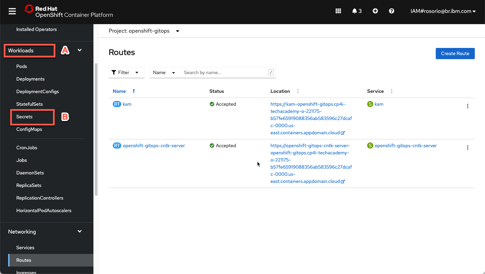
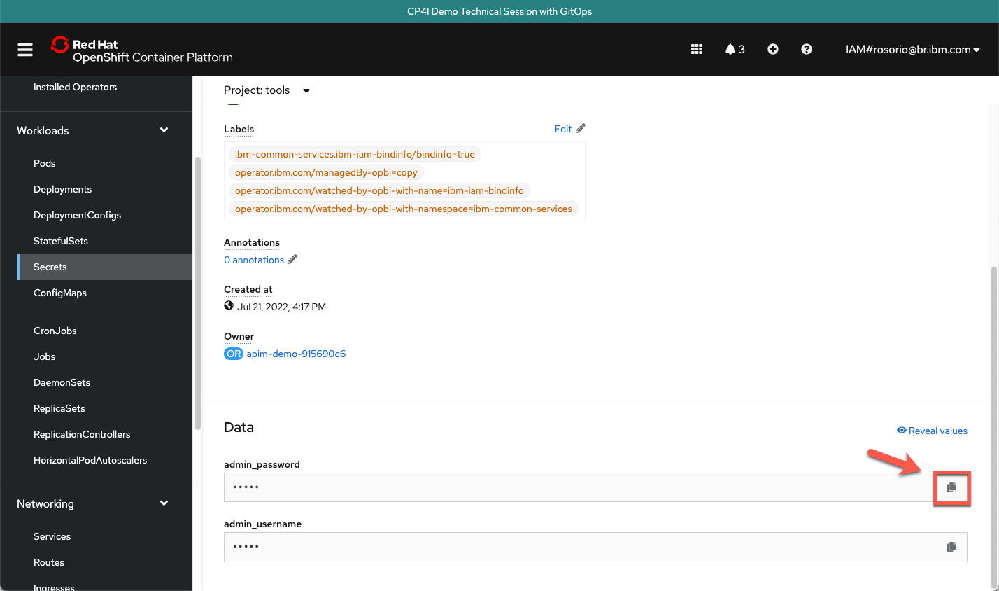

<FeatureCard
  title="Configuration to allow an Integration Flow developed with ACE Toolkit to connect to Event Streams"
  color="dark"
  >

</FeatureCard>

<AnchorLinks>
  <AnchorLink>Lab Overview</AnchorLink>
  <AnchorLink>Prerequisites</AnchorLink>
  <AnchorLink>Lab Environment</AnchorLink>
  <AnchorLink>0 - Preparation</AnchorLink>
  <AnchorLink>1 - Create a Topic in Event Streams</AnchorLink>
  <AnchorLink>2 - Create Resources in the ACE Toolkit</AnchorLink>
  <AnchorLink>3 - Create Configurations in ACE Dashboard</AnchorLink>
  <AnchorLink>4 - Deploy BAR file using ACE Dashboard</AnchorLink>
  <AnchorLink>Summary</AnchorLink>
</AnchorLinks>

***

## Lab Overview

The most interesting and impactful new applications in an enterprise are those that provide interactive experiences by reacting to existing systems carrying out a business function. In this tutorial, we take a look at an example. 

This session explains what configuration is needed to deploy an Integration Flow developed with ACE Toolkit that uses the Kafka Nodes to connect to an Event Streams cluster using the latest version of the ACE Integration Server Certified Container (ACEcc) as part of the IBM Cloud Pak for Integration.

Lab's takeways:
  - Creating and Configuring an EventStreams Topic
  - Configure App Connect Enterprise message flow using App Connect Enterprise toolkit
  - Configuring App Connect Enterprise service
  - Deploying App Connect BAR file on App Connect Enterprise Server
  - Testing App Connect Enterprise API sending a message to EventStreams

***

## Prerequisites

- You need to have an OpenShift environment with CP4I. For this session, your proctor will provide you a pre-installed environment, with admin access (more details below). If you want to create your personal environment, you can request an environment on IBM TechZone.
- You should have an MQ Queue Manager runtime pre-created in your CP4I on ROKS environment.
- You need to have the IBM App Connect Enterprise Toolkit installed in your desktop. Follow the sections Download IBM App Connect Enterprise for Developers and Install IBM App Connect Enterprise from <a href="https://www.ibm.com/docs/en/app-connect/11.0.0?topic=started-get-hands-experience" target="_blank">this tutorial</a> to install it.

***

## Lab Environment

For this session you will use a ROKS 4.10 environment with Cloud Pak for Integration 2022.2. For this section, your lab proctors pre-installed this cluster for you with a pre-configured IBM Event Streams instance.

***

## 0 - Preparation

In this section you will do some initial steps to prepare your environment for the lab.

Next steps, assume that you already accepted the Account invitation in IBM Cloud (account: 2543884 - itztsglenablement05). This is the same account of GitOps lab. If you didn't accept, please check <a href="https://ibm-integration.github.io/tech-academy-apac/gitops/#0-preparation" target="_blank">the GitOps lab preparation section</a> to complete it. 

1. Log in <a href="https://cloud.ibm.com/" target="_blank">IBM Cloud</a>.

2. In IBM Cloud dashboard, change your IBM Cloud account to **2543884 - itztsglenablement05**.

3. Now, click <a href="/tech-academy-apac/environments/" target="_blank">here</a> to open the **Team Environments** page.

4. Click to go to the **End-to-End Labs - Team Environments**.

5. Open your Team's section (A) (check the number of your team with the Lab's proctors). Then, open your team's **Cluster page** (B).

6. On your cluster’s page, click **OpenShift web console**.

7. Great, now let's check your Cloud Pak for Integration environment. First we need to get the Platform Navigator URL and password. Let's do it! Back to the OpenShift Web Console, open **Workloads** (A) and **Secrets** (B) again.

8. Now filter by **cp4i** project (A) and open the **ibm-iam-bindinfo-platform-auth-idp-credentials** secret (B).

9. Scroll down and click to copy the **admin_password**. You are welcome to take note of this password.

10. Now, let's get the Platform Navigator URL. Open **Networking** (A) and **Routes** (B).

11. Scroll down and click on the **cp4i-navigator-pn** location to open the Platform Navigator.

12. If necessary, accept all the risks, and click **IBM provided credentials (admin only)** link.

13. Log in with **admin** user and the password that you copied in the previous step.

14. Close the **Welcome** dialog. Great, now you are ready for the lab. Enjoy it!

***

## 1 - Create a Topic in Event Streams

***

## 2 - Create Resources in the ACE Toolkit

***

## 3 - Create Configurations in ACE Dashboard

***

## 4 - Deploy BAR file using ACE Dashboard

***

## Summary

You have successfully completed this lab. In this lab you learned:
  - Create and Configure an EventStreams Topic
  - Configure App Connect Enterprise message flow using App Connect Enterprise toolkit
  - Configure App Connect Enterprise service
  - Deploy App Connect BAR file on App Connect Enterprise Server
  - Test App Connect Enterprise API sending a message to EventStreams
