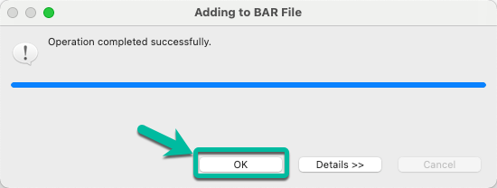

<FeatureCard
  title="Develop a REST API using ACE Toolkit to interact with MQ"
  color="dark"
  >

</FeatureCard>

<AnchorLinks>
  <AnchorLink>Lab Overview</AnchorLink>
  <AnchorLink>Prerequisites</AnchorLink>
  <AnchorLink>Lab Environment</AnchorLink>
  <AnchorLink>0 - Preparation</AnchorLink>
  <AnchorLink>1 - Low Code / No Code Development with ACE Toolkit</AnchorLink>
  <AnchorLink>2 - Deploy BAR file using ACE Dashboard</AnchorLink>
  <AnchorLink>3 - Testing the API</AnchorLink>
  <AnchorLink>Summary</AnchorLink>
</AnchorLinks>

***

## Lab Overview

IBM MQ can transport any type of data as messages, enabling businesses to build flexible and reusable architectures. It works with a broad range of computing platforms, applications, web services and communications protocols for security-rich message delivery. IBM MQ provides a communications layer for visibility and control of the flow of messages and data inside and outside your organization.

This session explains the steps need to create an Integration Flow developed with ACE Toolkit that uses the REST API functionality as well as the MQ Nodes to interact with an MQ Queue Manager using the latest version of the ACE Integration Server Certified Container (ACEcc) as part of the IBM Cloud Pak for Integration (CP4I).

Lab's takeways:
  - Creating an integration flow that connects to a message queue
  - Deploying the integration flow as a container in Kubernetes
  - Checking the message using MQ Web Console

***

## Prerequisites

- You need to have an OpenShift environment with CP4I. For this session, your proctor will provide you a pre-installed environment, with admin access (more details below). If you want to create your personal environment, you can request an environment on IBM TechZone.
- You should have an MQ Queue Manager runtime pre-created in your CP4I on ROKS environment.
- You need to have the IBM App Connect Enterprise Toolkit installed in your desktop. Follow the sections Download IBM App Connect Enterprise for Developers and Install IBM App Connect Enterprise from <a href="https://www.ibm.com/docs/en/app-connect/11.0.0?topic=started-get-hands-experience" target="_blank">this tutorial</a> to install it.
- You need to download the OpenAPI spec. Open this <a href="https://github.ibm.com/joel-gomez/cp4i-tech-jam/raw/main/artifacts/jgrmqapi.json" target="_blank">page</a> and save as swagger.json. You will use this spec later in the lab.

***

## Lab Environment

For this session you will use a ROKS 4.10 environment with Cloud Pak for Integration 2022.2. For this section, your lab proctors pre-installed this cluster for you with a pre-configured IBM MQ instance.

***

## 0 - Preparation

In this section you will do some initial steps to prepare your environment for the lab.

Next steps, assume that you already accepted the Account invitation in IBM Cloud (account: 2543884 - itztsglenablement05). This is the same account of GitOps lab. If you didn't accept, please check <a href="https://ibm-integration.github.io/tech-academy-apac/gitops/#0-preparation" target="_blank">the GitOps lab preparation section</a> to complete it. 

1. Log in <a href="https://cloud.ibm.com/" target="_blank">IBM Cloud</a>.

2. In IBM Cloud dashboard, change your IBM Cloud account to **2543884 - itztsglenablement05**.

3. Now, click <a href="/tech-academy-apac/environments/" target="_blank">here</a> to open the **Team Environments** page.

4. Click to go to the **End-to-End Labs - Team Environments**.

5. Open your Team's section (A) (check the number of your team with the Lab's proctors). Then, open your team's **Cluster page** (B).

6. On your cluster’s page, click **OpenShift web console**.

7. Great, now let's check your Cloud Pak for Integration environment. First we need to get the Platform Navigator URL and password. Let's do it! Back to the OpenShift Web Console, open **Workloads** (A) and **Secrets** (B) again.

8. Now filter by **cp4i** project (A) and open the **ibm-iam-bindinfo-platform-auth-idp-credentials** secret (B).

9. Scroll down and click to copy the **admin_password**. You are welcome to take note of this password.

10. Now, let's get the Platform Navigator URL. Open **Networking** (A) and **Routes** (B).

11. Scroll down and click on the **cp4i-navigator-pn** location to open the Platform Navigator.

12. If necessary, accept all the risks, and click **IBM provided credentials (admin only)** link.

13. Log in with **admin** user and the password that you copied in the previous step.

14. Close the **Welcome** dialog. Great, now you are ready for the lab. Enjoy it!

***

## 1 - Low Code / No Code Development with ACE Toolkit

1. Open the Toolkit in your workstation and create a new REST API project as shown below.

2. Give a name to your project, i.e. *MQAPI* and then select the option to *Import resources* since we will leverage a definition already created.

3. In the wizard click *Browse* and navigate to the location where the OpenAPI file definition is located.

4. Once the path is displayed in the *Location* field click *Finish*.

5. The REST API will be displayed, scroll to the right if needed to open the sunflow operation as shown in the image to proceed to implement the API logic.

6. The *Message Flow Editor* will be open with only the *Input* and *Output* terminals. Double click the tab to maximize the editor and work with the flow.

7. Drag and drop the *Nodes* from the palette to implemeng the "logic". In this case we will use the following nodes:
  * Flow Order Node,
  * HTTP Header Node,
  * MQ Header Node,
  * MQ Output Node, and
  * Mapping Node.

    And you will proceed to wire them. The flow should look like the one below. Once you are done double click the tab again in order to access the properties for each node.

8. Now we will configure each node, starting with the *HTTP Header Node*. Click on it to bring it to focus and then select the *HTTP Input* tab followed by the *Delete header* option as shown below.

9. Now select the *MQ Header Node* and navigate to the *MQMD* tab enabling the *Add header* option. And selecting *MQMFT_STRING* for the *Format* field as shown below.

10. Then select the *MQ Output Node* and in the *Basic* tab enter the name of the queue we will use to put the messages, in this case *CP4I.DEMO.API.Q*

11. In the same *MQ Output Node* navigate to the *MQ Connection* tab enter the information to connect to the Queue Manager. The information is based on the configuration we used for MQ, and for simplicity is included below.

Property | Value
---------|-------
Connection | ***MQ client connection properties***
Destination queue manager name | ***QMGRDEMO***
Queue manager host name | ***qmgr-demo-ibm-mq***
Listener port number | ***1414***
Channel name | ***ACE.TO.MQ***

12. Now double click the *Mapping Node*,

13. In the wizard window simply click *Finish*.

14. Expand the *JSON* section in both the input and output message assemblies and connect the *payload* as shown below.

15. Then *right click* the *code* field and select *Add Assign* from the menu.

16. In the properties section enter ***CP4I0000*** in the *value* field.

17. Repeat the same process for field *msg* and assign the value ***Request has been processed***

18. Do the same for field *time* but this time we will replace the *Assign* option with the *current-time* function as shown below.

19. The integration flow is completed. Save your progress and close the *mapping* tab.

***

## 2 - Deploy BAR file using ACE Dashboard

1. Now we will generate the BAR file that we will use to deploy the Integration into CP4I. From the *File* menu select *New* and then *BAR file* as shown below.

2. In the pop up window enter the name of the BAR file, in this case ***CP4IACEMQAPIPREM***. And then click *Finish*.

3. Click *OK* in the confirmation window.

4. The ***BAR Editor*** is open. Select ***Applications, shared libraries, services, REST APIs, and Test Projects*** to display the right type of resources and then select your application, in this case ***MQAPI***. Finally click ***Build and Save...*** to create the BAR file.

5. You can dismiss the notification window reporting the result clicking ***OK***.

***

## 3 - Deploy BAR file using ACE Dashboard

1. Back to Platform Navigator, open the **ACE Dashboard**.

2. To deploy a BAR file, you need to create an Integration server. Let’s do it! Click **Create a server**.

3. This will start the deployment wizard. Select the **Small Integration** tile and then click the **Next** button.

4. Click to upload your BAR File. And select the **MQAPI.bar**. And click **Next**.

5. You do not need to use the configuration package (configuration package contains the files that you can use for App Connect Enterprise works with Databases, Event Streams, etc) click **Next**.

6. On Create an Integration Server page, enter the Integration Server name as **neworder** (1). Then click **Create** (2).

  Great, your Integration Server was created!

  `Note:`` The deployment process takes up to 5 minutes, refresh the browser to see the BAR file deployed and started.

***

## 4 - Testing the API

1. Here you can see the App Connect Enterprise Dashboard with the Integration Server neworder deployed and started. Click the **neworder** server icon.

2. The next window shows the API in started state. Click on the tile to get the details.

3. In the next page navigate to the operation implemented in your flow (**POST /contacts**). Then click on the **Try it** tab followed by the **Generate** hyperlink to generate some test data. Review the data generated and click the **Send** button.

4. After a moment you will get a response back. If everything is OK you will receive a ***200*** response code indicating the request was successful and the same payload you sent plus some metadata including a timestamp showing the request completed few seconds ago.

5. Now, let’s check the message arrived in the NEWORDER queue in IBM MQ. Let’s use IBM MQ Console to check it. Open the **Menu**, and on **Run** section, click on **Messaging**.

6.Click Manage **QMGRDEMO**.

7. Here you can see that a new message has arrived in **CP4I.DEMO.API.Q** queue.

8.You are welcome, to click on the **CP4I.DEMO.API.Q** queue, to explore the message.

  Congratulations! Here you completed this lab.

***

## Summary

You have successfully completed this lab. In this lab you learned how to:
  - Create an integration flow that connects to a message queue
  - Deploy the integration flow as a container in Kubernetes
  - Check the message using MQ Web Console
